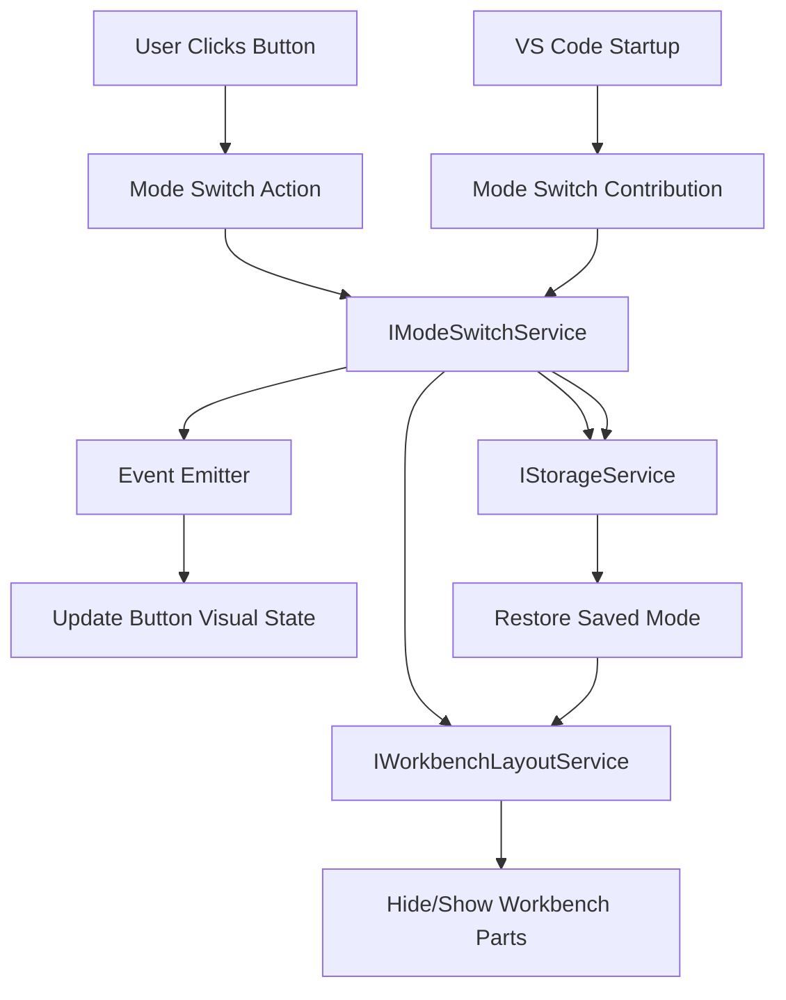

# Design Document: Title Bar Mode Switch

## Overview

This feature adds a mode switching button to the VS Code title bar that enables users to toggle between two distinct workbench layouts:

- **IDE Mode**: The standard VS Code workbench with all panels, sidebars, and editors visible
- **Partner Mode**: A blank layout page with minimal UI elements

The mode switch button will be integrated into the title bar's action toolbar, providing visual feedback for the current mode and persisting the user's preference across sessions. This implementation follows VS Code's contribution-based architecture and includes fork-specific change markers to minimize merge conflicts with upstream.

### Key Design Goals

1. Seamless integration with existing title bar infrastructure
2. Fast mode switching with visual feedback within 100ms
3. Persistent state management across sessions
4. Minimal impact on existing workbench functionality
4. Clear fork-specific change markers for maintainability

## Architecture

### Component Overview

The feature consists of four main components:

1. **Mode Switch Service** (`IModeSwitchService`): Core service managing mode state and transitions
2. **Mode Switch Action**: Action registered in the title bar menu for user interaction
3. **Mode Switch Contribution**: Workbench contribution that initializes the feature and coordinates components
4. **Layout Manager Integration**: Integration with `IWorkbenchLayoutService` to control part visibility

### Architecture Diagram



### Layer Assignment

Following VS Code's layered architecture:

- **Platform Layer**: Mode switch service interface and implementation (platform-agnostic)
- **Workbench Layer**: Mode switch contribution, action registration, and layout integration
- **Browser Layer**: Title bar button rendering and interaction handling

## Components and Interfaces

### 1. Mode Switch Service

**Location**: `src/vs/workbench/services/modeSwitch/common/modeSwitchService.ts`

```typescript
// test-workbench_change - new file

export const IModeSwitchService = createDecorator<IModeSwitchService>('modeSwitchService');

export enum WorkbenchMode {
    IDE = 'ide',
    Partner = 'partner'
}

export interface IModeSwitchService {
    readonly _serviceBrand: undefined;

    /**
     * Event fired when the mode changes
     */
    readonly onDidChangeMode: Event<WorkbenchMode>;

    /**
     * Get the current workbench mode
     */
    readonly currentMode: WorkbenchMode;

    /**
     * Toggle between IDE and Partner modes
     */
    toggleMode(): void;

    /**
     * Set a specific mode
     */
    setMode(mode: WorkbenchMode): void;
}
```

**Implementation**: `src/vs/workbench/services/modeSwitch/browser/modeSwitchService.ts`

```typescript
// test-workbench_change - new file

export class ModeSwitchService extends Disposable implements IModeSwitchService {
    declare readonly _serviceBrand: undefined;

    private readonly _onDidChangeMode = this._register(new Emitter<WorkbenchMode>());
    readonly onDidChangeMode = this._onDidChangeMode.event;

    private _currentMode: WorkbenchMode;
    private static readonly STORAGE_KEY = 'workbench.mode.state';

    constructor(
        @IStorageService private readonly storageService: IStorageService,
        @IWorkbenchLayoutService private readonly layoutService: IWorkbenchLayoutService,
        @
is._currentMode;
    }

    toggleMode(): void {
        const newMode = this._currentMode === WorkbenchMode.IDE
            ? WorkbenchMode.Partner
            : WorkbenchMode.IDE;
        this.setMode(newMode);
    }

    setMode(mode: WorkbenchMode): void {
        if (this._currentMode === mode) {
            return;
        }

        this.logService.info(`[ModeSwitchService] Switching mode from ${this._currentMode} to ${mode}`);

        this._currentMode = mode;
        this.applyMode(mode, true);
        this.saveMode(mode);
        this._onDidChangeMode.fire(mode);
    }

    private applyMode(mode: WorkbenchMode, animate: boolean): void {
        if (mode === WorkbenchMode.IDE) {
            this.applyIDEMode();
        } else {
            this.applyPartnerMode();
        }
    }

    private applyIDEMode(): void {
        // Show all standard workbench parts
        this.layoutService.setPartHidden(false, Parts.SIDEBAR_PART);
        this.layoutService.setPartHidden(false, Parts.PANEL_PART);
        this.layoutService.setPartHidden(false, Parts.AUXILIARYBAR_PART);
        this.layoutService.setPartHidden(false, Parts.EDITOR_PART);
        this.layoutService.setPartHidden(false, Parts.STATUSBAR_PART);
        this.layoutService.setPartHidden(false, Parts.ACTIVITYBAR_PART);
    }

    private applyPartnerMode(): void {
        // Hide all workbench parts except title bar
        this.layoutService.setPartHidden(true, Parts.SIDEBAR_PART);
        this.layoutService.setPartHidden(true, Parts.PANEL_PART);
        this.layoutService.setPartHidden(true, Parts.AUXILIARYBAR_PART);
        this.layoutService.setPartHidden(true, Parts.EDITOR_PART);
        this.layoutService.setPartHidden(true, Parts.STATUSBAR_PART);
        this.layoutService.setPartHidden(true, Parts.ACTIVITYBAR_PART);
    }

    private saveMode(mode: WorkbenchMode): void {
        this.storageService.store(
            ModeSwitchService.STORAGE_KEY,
            mode,
            StorageScope.PROFILE,
            StorageTarget.USER
        );
    }
}

// Register the service
registerSingleton(IModeSwitchService, ModeSwitchService, InstantiationType.Delayed);
```

### 2. Mode Switch Action

**Location**: `src/vs/workbench/contrib/modeSwitch/browser/modeSwitchActions.ts`

```typescript
// test-workbench_change - new file

export const TOGGLE_MODE_COMMAND_ID = 'workbench.action.toggleMode';

export class ToggleModeAction extends Action2 {
    constructor() {
        super({
            id: TOGGLE_MODE_COMMAND_ID,
            title: localize('toggleMode', 'Toggle Workbench Mode'),
            category: Categories.View,
            f1: true,
            icon: Codicon.layout,
            toggled: {
                condition: ContextKeyExpr.equals('workbench.mode', 'partner'),
                icon: Codicon.layoutPanel
            },
            menu: [{
                id: MenuId.TitleBar,
                group: 'navigation',
                order: 1,
                when: ContextKeyExpr.true()
            }]
        });
    }

    async run(accessor: ServicesAccessor): Promise<void> {
        const modeSwitchService = accessor.get(IModeSwitchService);
        modeSwitchService.toggleMode();
    }
}

registerAction2(ToggleModeAction);
```

### 3. Mode Switch Context Key

**Location**: `src/vs/workbench/contrib/modeSwitch/common/modeSwitchContextKeys.ts`

```typescript
// test-workbench_change - new file

export const WorkbenchModeContext = new RawContextKey<string>('workbench.mode', 'ide');
```

### 4. Mode Switch Contribution

**Location**: `src/vs/workbench/contrib/modeSwitch/browser/modeSwitch.contribution.ts`

```typescript
// test-workbench_change - new file

class ModeSwitchContribution extends Disposable implements IWorkbenchContribution {
    static readonly ID = 'workbench.contrib.modeSwitch';

    private readonly modeSwitchContextKey: IContextKey<string>;

    constructor(
        @IModeSwitchService private readonly modeSwitchService: IModeSwitchService,
        @IContextKeyService contextKeyService: IContextKeyService
    ) {
        super();

        // Initialize context key
        this.modeSwitchContextKey = WorkbenchModeContext.bindTo(contextKeyService);
        this.modeSwitchContextKey.set(this.modeSwitchService.currentMode);

        // Listen for mode changes
        this._register(this.modeSwitchService.onDidChangeMode(mode => {
            this.modeSwitchContextKey.set(mode);
        }));
    }
}

// Register contribution
Registry.as<IWorkbenchContributionsRegistry>(WorkbenchExtensions.Workbench)
    .registerWorkbenchContribution(ModeSwitchContribution, LifecyclePhase.Restored);

// Import actions
import './modeSwitchActions.js';
```

## Data Models

### Mode State

The mode state is represented by a simple enum with two values:

```typescript
export enum WorkbenchMode {
    IDE = 'ide',      // Standard workbench layout
    Partner = 'partner' // Blank layout
}
```

### Storage Schema

Mode state is persisted using the `IStorageService`:

- **Key**: `workbench.mode.state`
- **Scope**: `StorageScope.PROFILE` (per user profile)
- **Target**: `StorageTarget.USER` (user-specific, not workspace-specific)
- **Value**: String enum value (`'ide'` or `'partner'`)
- **Default**: `'ide'` (when no saved state exists)

### Context Key Schema

The current mode is exposed via a context key for conditional UI rendering:

- **Key**: `workbench.mode`
- **Type**: String
- **Values**: `'ide'` | `'partner'`
- **Usage**: Controls button icon toggling and other conditional UI elements

## Correctness Properties

*A property is a characteristic or behavior that should hold true across all valid executions of a system—essentially, a formal statement about what the system should do. Properties serve as the bridge between human-readable specifications and machine-verifiable correctness guarantees.*

### Property 1: Mode Toggle Idempotence

*For any* initial mode state, toggling the mode twice should return to the original state.

**Validates: Requirements 2.1, 2.4**

### Property 2: Button Visual State Reflects Current Mode

*For any* mode state (IDE or Partner), the mode switch button's visual properties (icon, tooltip, CSS classes) should correctly indicate that mode.

**Validates: Requirements 1.2**

### Property 3: Mode Persistence Round Trip

*For any* mode state, saving the mode then restoring it (simulating app restart) should preserve the exact same mode.

**Validates: Requirements 5.1, 5.2**

### Property 4: Layout Update Performance

*For any* mode transition, the workbench layout should update within 100ms of the mode change event.

**Validates: Requirements 7.1**

### Property 5: Button Visual Update Performance

*For any* mode transition, the mode switch button's visual state should update within 100ms of the mode change event.

**Validates: Requirements 7.2**

## Error Handling

### Service Initialization Errors

If the `ModeSwitchService` fails to initialize (e.g., storage service unavailable):
- Log error with `ILogService`
- Default to IDE mode
- Continue operation without persistence

### Layout Service Errors

If `IWorkbenchLayoutService` operations fail:
- Log error with `ILogService`
- Attempt to revert to previous mode
- Show notification to user if revert fails

### Storage Errors

If mode state cannot be persisted:
- Log warning with `ILogService`
- Continue operation (mode will not persist across sessions)
- Do not block user interaction

### Invalid Stored Mode

If stored mode value is invalid or corrupted:
- Log warning with `ILogService`
- Default to IDE mode
- Overwrite invalid value with default

## Testing Strategy

### Unit Testing

Unit tests will verify specific behaviors and edge cases:

1. **Service Initialization**
   - Test default mode when no saved state exists (edge case from 5.3)
   - Test mode restoration from storage
   - Test invalid stored mode handling

2. **Mode Switching**
   - Test IDE to Partner mode transition (example from 2.3)
   - Test Partner to IDE mode transition (example from 2.2)
   - Test mode state persistence after toggle

3. **UI Integration**
   - Test button visibility in title bar (example from 1.1)
   - Test button mouse interaction (example from 1.3)
   - Test button keyboard accessibility (example from 1.4)
   - Test hover feedback (example from 7.3)
   - Test active/pressed feedback (example from 7.4)

4. **Layout Verification**
   - Test IDE mode shows all UI elements (example from 3.1)
   - Test Partner mode hides workbench parts (example from 4.2)
   - Test title bar remains visible in Partner mode (example from 4.3)
   - Test window controls work in Partner mode (example from 4.4)

5. **Functionality Preservation**
   - Test editor functionality in IDE mode (example from 3.2)
   - Test panel functionality in IDE mode (example from 3.3)
   - Test sidebar functionality in IDE mode (example from 3.4)

### Property-Based Testing

Property-based tests will verify universal behaviors across all inputs using a PBT library (fast-check for TypeScript):

Each property test will run a minimum of 100 iterations and include a comment tag referencing the design property.

1. **Property 1: Mode Toggle Idempotence**
   ```typescript
   // Feature: title-bar-mode-switch, Property 1: For any initial mode state, toggling twice returns to original
   fc.assert(
       fc.property(fc.constantFrom(WorkbenchMode.IDE, WorkbenchMode.Partner), (initialMode) => {
           service.setMode(initialMode);
           service.toggleMode();
           service.toggleMode();
           return service.currentMode === initialMode;
       }),
       { numRuns: 100 }
   );
   ```

2. **Property 2: Button Visual State Reflects Current Mode**
   ```typescript
   // Feature: title-bar-mode-switch, Property 2: Button visual state matches current mode
   fc.assert(
       fc.property(fc.constantFrom(WorkbenchMode.IDE, WorkbenchMode.Partner), (mode) => {
           service.setMode(mode);
           const buttonState = getButtonVisualState();
           return buttonState.mode === mode;
       }),
       { numRuns: 100 }
   );
   ```

3. **Property 3: Mode Persistence Round Trip**
   ```typescript
   // Feature: title-bar-mode-switch, Property 3: Save then restore preserves mode
   fc.assert(
       fc.property(fc.constantFrom(WorkbenchMode.IDE, WorkbenchMode.Partner), (mode) => {
           service.setMode(mode);
           const saved = storage.get(STORAGE_KEY);
           const restored = createNewService(storage);
           return restored.currentMode === mode;
       }),
       { numRuns: 100 }
   );
   ```

4. **Property 4: Layout Update Performance**
   ```typescript
   // Feature: title-bar-mode-switch, Property 4: Layout updates within 100ms
   fc.assert(
       fc.property(fc.constantFrom(WorkbenchMode.IDE, WorkbenchMode.Partner), async (mode) => {
           const startTime = performance.now();
           service.setMode(mode);
           await waitForLayoutUpdate();
           const elapsed = performance.now() - startTime;
           return elapsed < 100;
       }),
       { numRuns: 100 }
   );
   ```

5. **Property 5: Button Visual Update Performance**
   ```typescript
   // Feature: title-bar-mode-switch, Property 5: Button updates within 100ms
   fc.assert(
       fc.property(fc.constantFrom(WorkbenchMode.IDE, WorkbenchMode.Partner), async (mode) => {
           const startTime = performance.now();
           service.setMode(mode);
           await waitForButtonUpdate();
           const elapsed = performance.now() - startTime;
           return elapsed < 100;
       }),
       { numRuns: 100 }
   );
   ```

### Testing Approach

- **Unit tests** focus on specific examples, edge cases (like default mode), and integration points
- **Property tests** verify universal behaviors across all mode states and transitions
- Together they provide comprehensive coverage: unit tests catch concrete bugs, property tests verify general correctness
- All tests will be located in `src/vs/workbench/contrib/modeSwitch/test/browser/`

