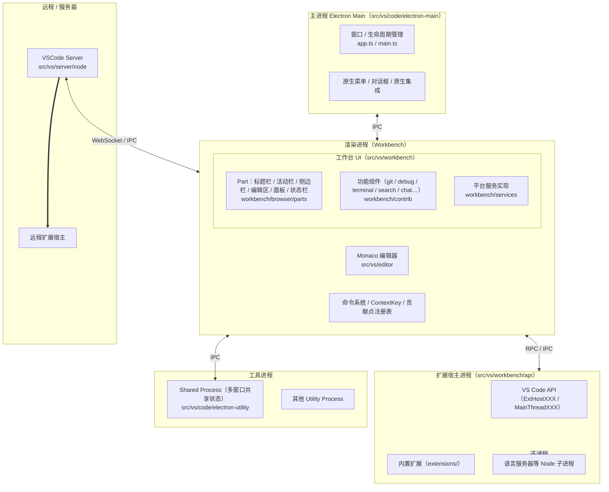
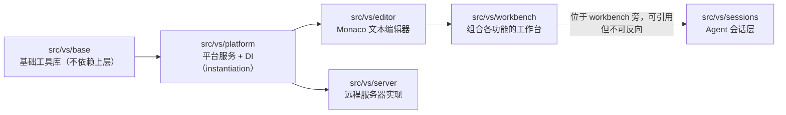

# VS Code 架构图

## 1. 进程架构

说明：
- **Web / 浏览器模式**（`src/vs/workbench/web.main.ts`）下没有 Electron 主进程，渲染进程（Web Worker / iframe）直接通过 Socket 连接 VSCode Server。
- **Agents 会话层** `src/vs/sessions/` 位于 workbench 旁，可引用 workbench，反之不可。

## 2. 分层架构

核心原则：

- **分层依赖**：`base` → `platform` → `editor` → `workbench`，上层引用下层，禁止反向。
- **依赖注入**：服务通过构造器参数注入（`IInstantiationService` 创建），避免隐式依赖。
- **贡献点模型**：功能通过 registry / contribution 注册到工作台，扩展则通过 `package.json` 的 `contributes` 扩展能力。
- **跨平台抽象**：`common`（逻辑）+ `browser`/`node`（平台差异）分离，保证 Web 与 Desktop 复用。

## 3. 模块 / 目录地图

| 目录 | 职责 |
| --- | --- |
| `src/vs/base` | 跨平台基础工具：Observable、事件、URI、工具函数 |
| `src/vs/platform` | 核心服务接口与实现：DI、命令、配置、文件系统、存储、Promise 等 |
| `src/vs/editor` | Monaco 编辑器内核：模型、视图、语言服务、CodeLens、贡献点 |
| `src/vs/workbench/browser` | 工作台 UI：Part、布局、code editor 组合、web.main 入口 |
| `src/vs/workbench/contrib` | 各功能贡献模块（git、debug、terminal、search、chat…） |
| `src/vs/workbench/services` | 工作台级服务实现（editorService、filesService、layoutService…） |
| `src/vs/workbench/api` | 扩展宿主：`ExtHost*` / `MainThread*` 通道通信 |
| `src/vs/code` | Electron 主进程 / 工具进程（sharedProcess）/ CLI 入口 |
| `src/vs/server` | 远程场景（Web / Server）的服务器端实现 |
| `src/vs/sessions` | Agent 会话专用工作台层 |
| `extensions/` | 随 VSCode 一起发布的内置扩展 |

## 4. 关键机制

- **进程通信**：主进程 ⇄ 渲染进程走 **IPC**；渲染进程 ⇄ 扩展宿主走 **RPC**（`Channel` / `Proxy`）；远程场景走 Socket 隧道。
- **Extension Host**：扩展代码运行在独立进程，通过 `ExtHostAPIAdapter` 暴露受控 API，崩溃不影响主进程。
- **远程架构**：本地渲染进程通过 WebSocket 连接 Server，文件、搜索、终端、扩展宿主等可在远程侧运行，形成 Remote Extension Host（`src/vs/workbench/api/node` + server 侧）。
- **语言服务**：常见模式为扩展宿主 fork 子进程（如 TS/Java 语言服务器），或通过 vscode-languageclient 与进程通信。